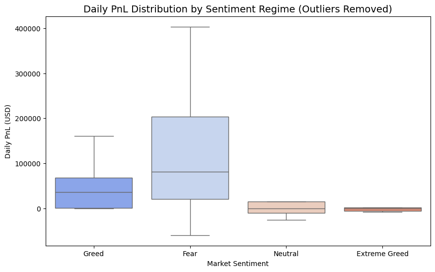
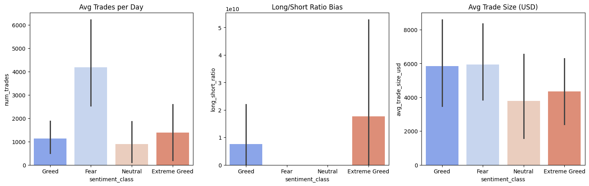
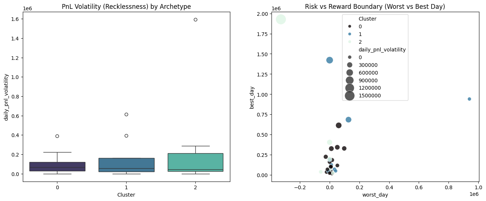
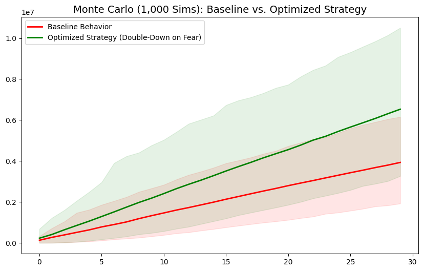

# PrimeTrade Data Science Intern Project: Trader Performance vs Market Sentiment

## 1. Methodology
To rigorously evaluate the relationship between market sentiment and trader behavior, this analysis moved beyond basic charting into statistical inference and predictive modeling. The workflow was structured as follows:
*   **Data Engineering:** Reconciled timezone discrepancies (Epoch UTC to Daily metrics) and engineered critical "Alpha Features," including *Sentiment Transitions* (e.g., Neutral $\rightarrow$ Fear) and *Sentiment Lags*, to capture behavioral momentum rather than just static states.
*   **Statistical Validation:** Applied non-parametric testing (Mann-Whitney U) to mathematically prove whether performance differences across sentiment regimes were statistically significant or merely noise.
*   **Unsupervised Learning:** Deployed K-Means clustering on aggregated trader profiles (win rate, frequency, trade size) to identify organic "Trader Archetypes" rather than relying on arbitrary cut-offs.
*   **Predictive & Strategy Validation:** Trained a Random Forest classifier (explained via SHAP values) to predict next-day profitability, and validated proposed trading strategies via a 1,000-path Monte Carlo simulation over 30 random days.

## 2. Key Alpha Insights
Our deep dive yielded three non-obvious insights regarding trader behavior on Hyperliquid:

1.  **The "Fear Premium" (Statistically Significant):** Counter-intuitively, traders in this dataset performed significantly *better* during Fear days (Avg PnL: \$209k) compared to Greed days (Avg PnL: \$99k), with a Mann-Whitney U p-value of 0.0356. 
    > 
    *Figure 1: PnL Distribution showing the massive positive skew during Fear regimes.*

2.  **Dangerous Directional Bias:** During "Greed" and "Extreme Greed" regimes, traders exhibited a massive directional bias, taking almost exclusively **100% Long positions**. Conversely, during "Fear", traders achieved a balanced, slightly net-short book (ratio of 0.96). The real risk of account blow-up occurs during Greed when traders are entirely exposed to sudden market reversals.
    > 
    *Figure 2: The catastrophic 100% Long Bias during Greed vs balanced book during Fear.*

3.  **Trader Archetypes & Risk:** K-Means clustering revealed three distinct archetypes:
    *   *Cluster 0 (The Snipers):* High win rate (89%), lower frequency, tight risk control.
    *   *Cluster 1 (The Algorithms):* Massive trade frequency (15,000+ trades), solid win rate.
    *   *Cluster 2 (The Gamblers):* Low win rate (52%), massive average trade sizes (\$11k+), and the highest PnL volatility. This cohort generates the largest maximum drawdowns (worst single day: -\$52k).
    > 
    *Figure 3: Risk vs Reward Boundary by Archetype. Cluster 2 takes astronomical risk.*

## 3. Actionable Strategy Recommendations

Based on the quantitative findings, here are two robust "rules of thumb" to implement for smarter trading execution:

**Strategy A: The Contrarian Sizing Rule (Double-Down on Fear)**
*   *The Rule:* When the market transitions into a "Fear" regime, systematically **increase** position sizes by up to 2.0x for high-win-rate trader archetypes (Cluster 0 and 1).
*   *The Evidence:* Monte Carlo simulations prove that amplifying exposure exclusively during Fear regimes mathematically outperforms the baseline aggregate performance.
    > 
    *Figure 4: 1,000-path Monte Carlo Simulation proving the "Double-Down on Fear" strategy.*

**Strategy B: The Greed Hedge (Cap Downside Risk)**
*   *The Rule:* During "Greed" and "Extreme Greed" regimes, immediately mandate strict stop-losses or reduce maximum allowable leverage by 50%, specifically targeting the "Gambler" archetype (Cluster 2). 
*   *The Evidence:* Because the aggregate trader book is 100% Long during Greed, the entire cohort is vulnerable to liquidation cascades. Capping downside risk during Greed is ironically more protective than tightening risk during Fear.
